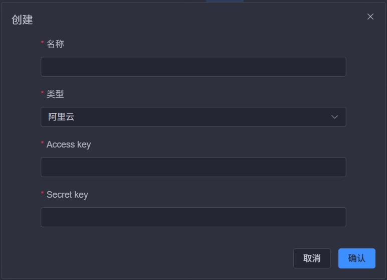
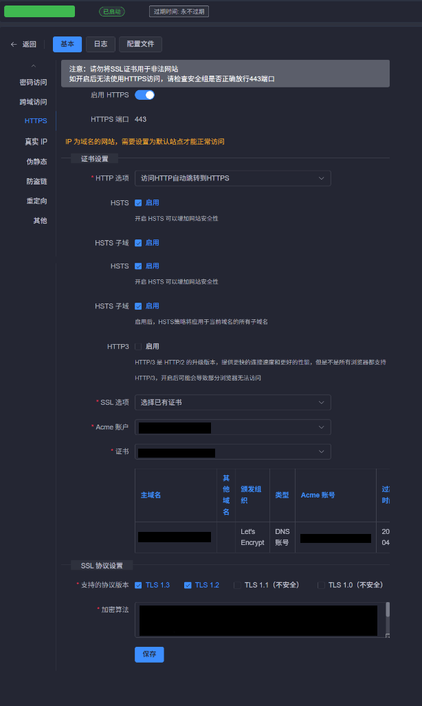

# 1Panel 配置自动续签的 SSL 证书

本文介绍如何使用 1Panel 配置 Let's Encrypt SSL 证书，并开启自动续签功能。

## 配置步骤

### 步骤一：创建 ACME 账户

1. 登录 1Panel 面板，进入 **网站** -> **证书** 页面
2. 点击 **ACME 账户** -> **创建**
3. 填写邮箱地址
4. 账号类型选择 **Let's Encrypt**
5. 加密算法保持默认
6. 点击 **确定**

### 步骤二：添加 DNS 账户

1. 点击 **DNS 账户** 选项卡
2. 选择你使用的 DNS 服务商（如阿里云、腾讯云等）
3. 填写对应的 **Access Key** 和 **Secret Key**
4. 点击 **保存**

### 步骤三：申请 SSL 证书

1. 点击 **申请证书**
2. 填写以下信息：

| 配置项 | 说明 |
|--------|------|
| 主域名 | 如 `example.com` |
| 其他域名 | 如 `*.example.com`（可选） |
| ACME 账户 | 选择刚才创建的账户 |
| 验证方式 | 选择 **DNS 账号** |
| DNS 账户 | 选择刚才添加的 DNS 账户 |
| 自动续签 | 勾选此项 |

3. 点击 **确定**，1Panel 会自动申请证书

### 步骤四：为网站配置 HTTPS

1. 进入 **网站** -> **网站** 页面
2. 点击目标网站进入 **网站详情**
3. 切换到 **HTTPS** 选项卡
4. 启用 **HTTPS**
5. SSL 选项选择 **已有证书**
6. 选择刚才申请的证书
7. 点击 **保存**

1Panel 会自动配置 SSL 证书，之后访问网站即可使用 HTTPS。
